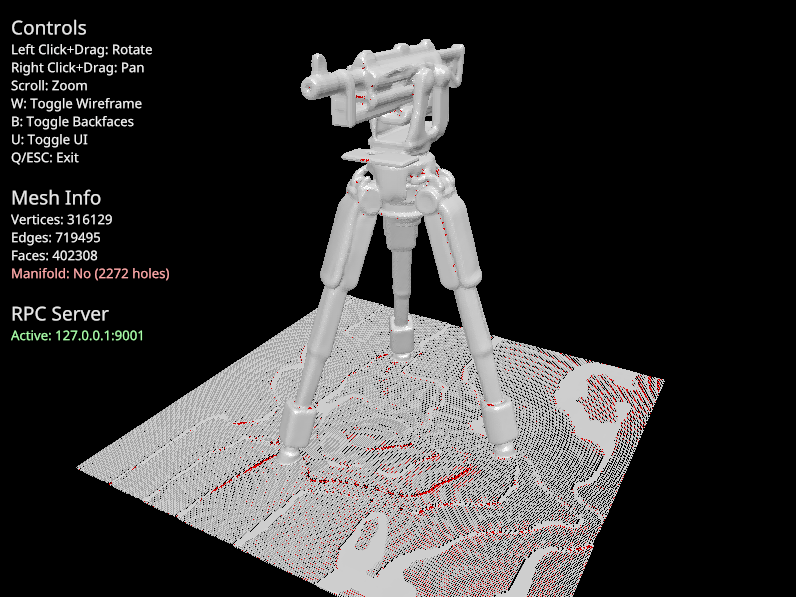

# msh - 3D Mesh CLI Tool

A command-line tool for 3D mesh analysis, repair, and visualization. Supports
`.obj` and `.glb` file formats.

## Features

- **Mesh Remeshing**: Fix and incrementally remesh your 3D models with multiple
  algorithms
- **3D Viewer**: Interactive viewer for inspecting meshes
- **Mesh Analysis**: Get detailed statistics about your mesh
- **Manifold Checking**: Verify if your mesh is watertight
- **Automatic Repair**: Fix holes and issues in damaged meshes



## Installation

Build from source:

```bash
cargo build --release
```

The executable will be available at `./target/release/msh`.

## Usage

### View a Mesh

Interactively view a mesh file in a 3D viewer:

```bash
msh view <INPUT>
msh view model.obj
msh view scene.glb --mesh name  # For GLB files with multiple meshes
```

**Options:**

- `-m, --mesh <MESH>`: Mesh name (required if GLB contains multiple meshes)

### Remesh a Mesh

Remesh a file with automatic fixing and incremental remeshing:

```bash
msh remesh <INPUT> --out <OUTPUT>
msh remesh model.obj --out fixed.obj
msh remesh scene.glb --out output.obj --mesh meshname
```

**Options:**

- `-o, --out <OUT>`: Output mesh file (.obj) - **required**
- `-m, --mesh <MESH>`: Mesh name (required if GLB contains multiple meshes)
- `-i, --iterations <ITERATIONS>`: Number of incremental remeshing iterations
  (default: 10)
- `-t, --target-edge-length <TARGET_EDGE_LENGTH>`: Target edge length for
  incremental remeshing (default: 0.01)
- `-v, --voxel-size <VOXEL_SIZE>`: Voxel size for fix step (default: 0.01)
- `--tolerance <TOLERANCE>`: Vertex merge tolerance for fix step (default:
  0.0001)
- `--no-fix`: Skip the fix step (just do incremental remesh)

**Remeshing Methods:**

- **Incremental** (default): Edge-based operations that progressively improve
  mesh quality

  ```bash
  msh remesh model.obj --out output.obj incremental
  ```

- **Voxel**: Converts mesh to signed distance field (SDF) then remeshes for
  clean topology

  ```bash
  msh remesh model.obj --out output.obj voxel
  ```

### Get Mesh Statistics

Display detailed information about a mesh:

```bash
msh stats <INPUT>
msh stats model.obj
msh stats scene.glb --mesh meshname
```

**Options:**

- `-m, --mesh <MESH>`: Mesh name (required if GLB contains multiple meshes)

### Check if Mesh is Manifold

Verify if a mesh is manifold (watertight):

```bash
msh check <INPUT>
msh check model.obj
```

**Options:**

- `-m, --mesh <MESH>`: Mesh name (required if GLB contains multiple meshes)

### Fix Mesh Holes

Automatically fix holes and issues in a damaged mesh:

```bash
msh fix <INPUT> --out <OUTPUT>
msh fix damaged.obj --out fixed.obj
```

**Options:**

- `-o, --out <OUT>`: Output mesh file (.obj) - **required**
- `-m, --mesh <MESH>`: Mesh name (required if GLB contains multiple meshes)
- `-v, --voxel-size <VOXEL_SIZE>`: Voxel size for remeshing (default: 0.01)
- `-t, --tolerance <TOLERANCE>`: Merge vertices closer than this distance before
  fixing (default: 0.0001)
- `--no-merge`: Skip vertex merging step

## Supported Formats

- **Input:** `.obj`, `.glb`
- **Output:** `.obj`

## Common Workflows

**Repair a damaged mesh:**

```bash
msh fix broken.obj --out repaired.obj
```

**High-quality remesh with custom edge length:**

```bash
msh remesh model.obj --out output.obj --target-edge-length 0.005 --iterations 20
```

**Voxel-based remeshing for topology cleanup:**

```bash
msh remesh model.obj --out clean.obj voxel --voxel-size 0.02
```

**Inspect mesh before and after:**

```bash
msh view original.obj
msh remesh original.obj --out fixed.obj
msh view fixed.obj
```
